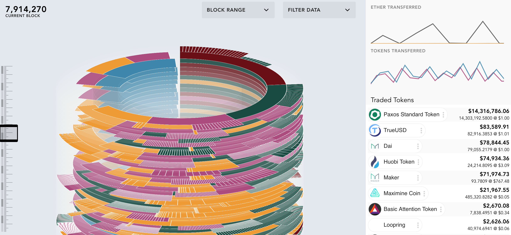
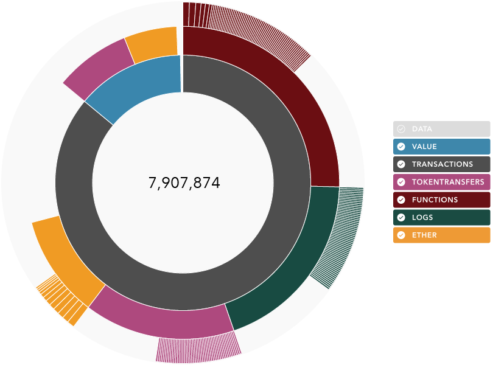

# Visualizations for Blockchain & Market Data

##### Sample Block

## Start Development & Testing Locally

1. Clone the repo and run `npm install`

The repo development is mainly in `/src`, `/api` and `/test`.

#### To run local development website:
`npm run dev` - Starts server & watches folders

#### Helpful Commands
- `npm run build` - Builds compiled client deployable package
- `npm test` - Runs all tests
